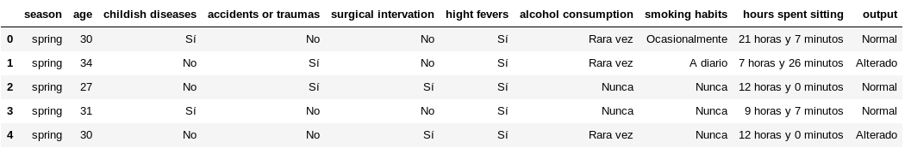

# lab-import-export

Por idea de Paco, he hecho un Bonus Challenge más al lab, al que he llamado "Haz la tabla legible".

Consiste en, según la descripción de los datos del dataset *fertility*, "traducir" los datos para mostrar el dataframe más legible.

He utilizado los siguientes dos métodos de pandas para realizar el ejercicio:

* `replace()`: El cual utilizo para agregar valores a través de un diccionario previamente definido.

* `apply()`: Que uso en las columnas `age` y `hours spent sitting` para modificar sus datos según estos mismos y una función. He utilizado la **función lambda** para no depender de una función externa.

El resultado del ejercicio ha sido el siguiente:

