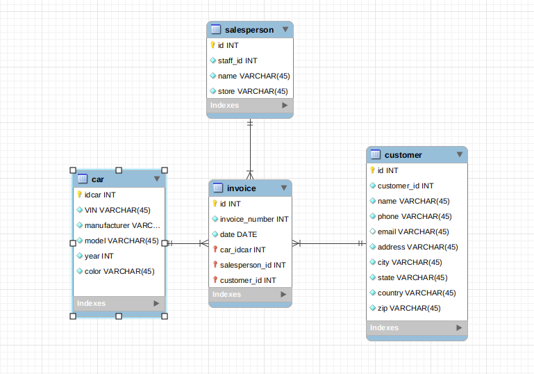

# Lab-mysql

## create.sql

He considerado que todas las entidades (car, customer y salesperson) tienen una relación 1-n con la entidad invoice.

He creado los ID con autoincrement, para evitar añadirlos manualmente luego.

El año es de tipo INT. He intentado hacerlo con tipo YEAR() pero Workbench no me dejaba.

Todos los VARCHAR los he dejado con la longitud predeterminada. Aunque con los datos actuales se podría reducir mucho, en un futuro no sabes que tienes que agregar a la tabla y considero que es mejor "que sobre" que "que falte". No obstante, imagino que hay que adaptar mejor la longitud a los datos.

He marcado también algunos valores como únicos y la mayoría como no nulos (a excepción del email).

## seeding.sql

He realizado los INSERT TO según las tablas del README.md del lab. Sin embargo, he tenido que cambiar las IDs de las claves foráneas: Al usar AI, las ID me empiezan an 1 y en el ejercicio por 0. Por tanto, he sumado uno a estas claves.

Los emails de la entidad salesperson les he insertado "-", si bien, considero que también se podrían haber dejado vacías (haberlas eliminado del INSERT TO).

También he realizado las tablas update.sql y delete.sql
