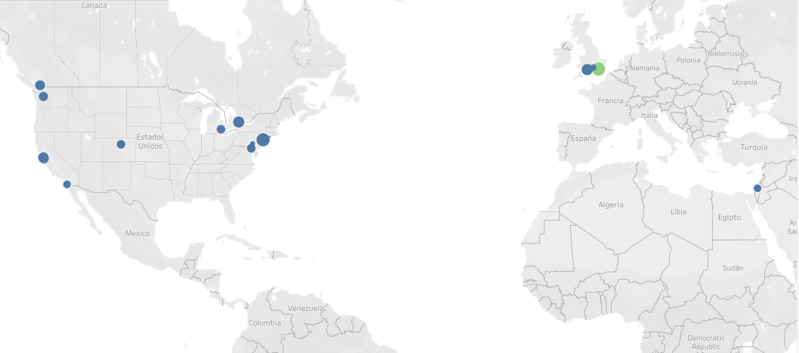
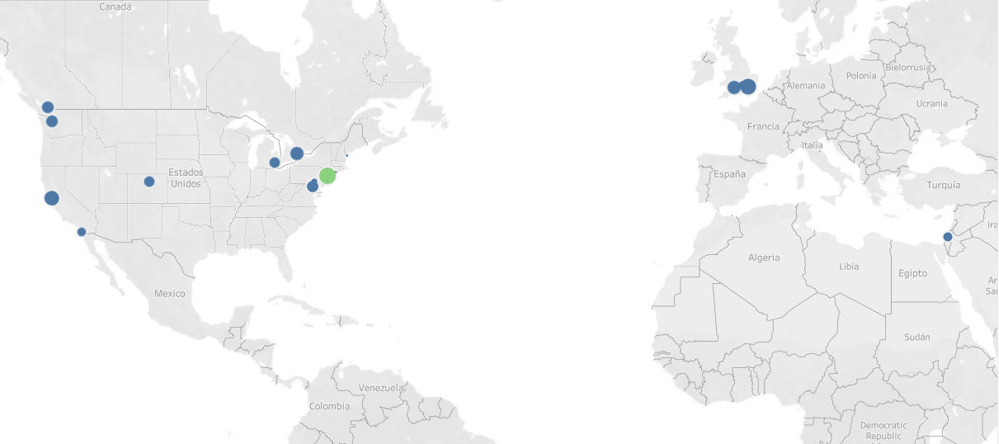
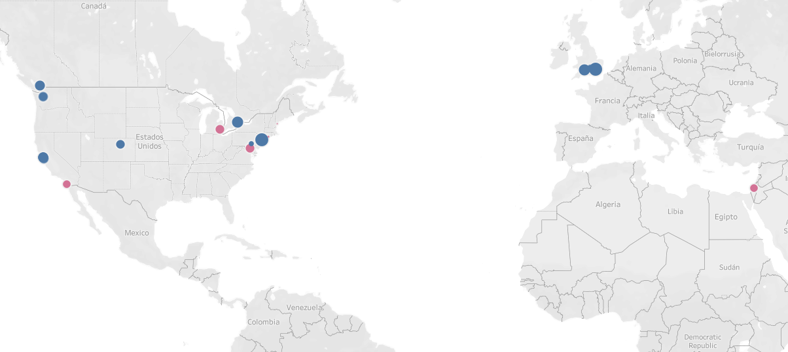
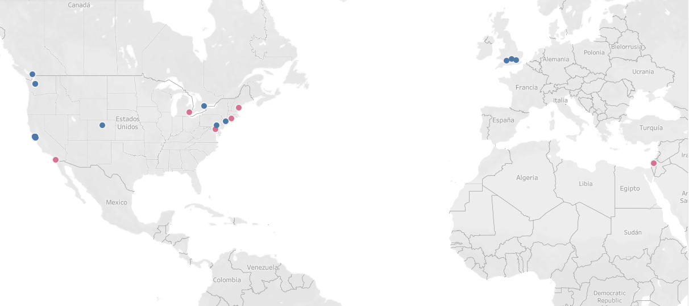

Proyecto: project-mongodb-geospatial-queries

El objetivo del trabajo consistía en encontrar el punto óptimo de la tierra en el que situar nuestra empresa. Para ello he utilizado el dataset "companies" y la API de google places.

Para encontrar el lugar óptimo, he intentado buscar aquella empresa que se parecía más a la mía en base a las condiciones exigidas. De manera, que al encontrar esa empresa óptima, mi empresa se situaría a su lado.

He seguido los siguientes pasos:

1. He creado una columna que contiene la latitud y otra que contiene la longitud de cada empresa.

2. He limpiado la columna "total_money_raised". Se exigía que la empresa se situase cerca alguna startup que hubiese recaudado más de un millón de euros.

3. He utilizado el módulo textdistance para obtener aquellas empresas relacionadas con el diseño.

4. He accedido a la API de googleplaces para enriquecer mi dataframe. Concretamente mi objetivo era obtener información acerca del número de colegios, restaurantes, gimnasios, sitios de copas, aeropuertos, paradas de taxi... que se encontrasen alrededor de cada empresa. Para cada una de esas carácterísticas he creado una columna con el número de apariciones en un radio x respecto de cada una de las empresas.

5. Una vez que ya tenía el número de apariciones he calculado la desvicación de cada registro respecto de la media de su columna (estandarización). Posteriormente he creado la columna "SUM", que contiene la suma de los registros (una vez que ya habían sido estandarizados) de cada compañía. De esta forma, aquella compañía cuya suma sea la mayor será la empresa óptima, a cuyo lado debería situar mi empresa.

------------------En este punto tenía un dataframe1 con 27 registros--------------------------

6. Uno de los requisitos era que nuestra compañía estuviese alejada por lo menos dos kilómetros de compañías que tuviesen más de 10 años. Para conseguirlo, he creado una dataframe2 con aquellas compañías que tuviesen más de 10 años. He creado una columna con su latitud y longitud. Posteriormente he creado una función que me devolviese el número de compañías que se encontraban en un radio inferior a 2 kilómetros de cada compañía contenida en mi dataframe1 original. Esta función me devuelve una lista con el número de compañías que se encuentran en un radio inferior a 2 kilómetros. Cada índice corresponde a una compañía del dataframe1.

7. A continuación he convertido la columna en una lista, la he estandarizadodo, y como tener un número elevado es considerado como algo negativo, lo sustraigo de la columna "SUM" y creo la columna "SUM_TOTAL". Aquella empresa cuyo "SUM_TOTAL" sea máximo, será la empresa a cuyo alrededor sitúe la mía.

8. He incluido la posibilidad de ponderar el peso de las columnas.

9. He realizado una serie de visualizaciones con Tableau.

