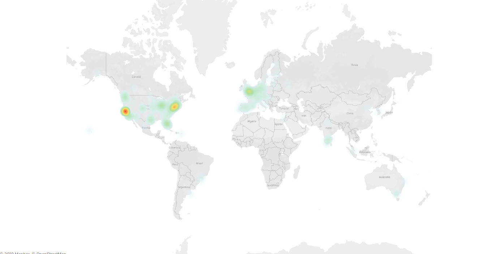

# Pipelines Project

<p style="background-color:#e6e6e6;font-style:italic;padding:15px;">Este repositorio es un proyecto realizado como tarea durante el bootcamp de Data Analytics de <a href="https://www.ironhack.com/" title="Ironhack">Ironhack</a>.</p>

# Objetivo

El objetivo es encontrar la mejor ubicación para una nueva oficina según unos requerimientos. En concreto, los siguientes:

```
## TODO's

You recently created a new company in the `GAMING industry`. The company will have the following scheme:

- 20 Designers 22.99%
- 5 UI/UX Engineers 5.75%
- 15 Data Engineers 17.24%
- 10 Frontend Developers 11.49%
- 5 Backend Developers 5.75%
- 20 Account Managers 22.99%
- 1 Maintenance guy that loves basketball 1.5 %
- 10 Executives 11.49%
- 1 CEO/President 1.5%

As a data engineer you have asked all the employees to show their preferences on where to place the new office.
Your goal is to place the **new company offices** in the best place for the company to grow.
You have to found a place that more or less covers all the following requirements.
Note that **it's impossible to cover all requirements**, so you have to prioritize at your glance.

- Designers like to go to design talks and share knowledge. There must be some nearby companies that also do design.
- 30% of the company have at least 1 child.
- Developers like to be near successful tech startups with that have raised at least 1 Million dollars.
- Executives like Starbucks A LOT. Ensure there's a starbucks not to far.
- Account managers need to travel a lot
- All people in the company have between 25 and 40 years, give them some place to go to party.
- Nobody in the company likes to have companies with more than 10 years in a radius of 2 KM.
- The CEO is Vegan

## How to deliver the project

- You must justify your decision with tableau slides. Provide us the public tableau link inside a README.md
  file at dir `module-2/project-mongodb-geospartial-queries`.
- Provide `lat` and `long` for the new offices.

## Links & Resources

- https://docs.mongodb.com/manual/geospatial-queries/
- https://developers.google.com/maps/documentation/geocoding/intro
- https://data.crunchbase.com/docs
- https://developers.google.com/places/web-service/search
- https://www.youtube.com/watch?v=PtV-ZnwCjT0
```

La dataset de la que se obtienen los datos es una lista de empresas obtenida de [Crunchbase](https://www.crunchbase.com/).


## Archivos

Los archivos que contiene el proyecto son (por orden de ejecución):

* `first-clean.py`: Limpieza del dataset inicial. Se limpian fundamentalmente las columnas `total_money_raised` y `offices`. Devuelve un archivo .json que se almacen en la carpeta dataset.
* `dataset/companies_cleaned.json`: Archivo que devuelve `first-clean.py`. El archivo se importa a MongoDB como  y se le crea un geoindex.
* `main.py`: Archivo principal que llama a todas las funciones para ejecutar el programa.
* `extractors.py`: Extracción de los datos de trabajo. Toma como input el nuevo documento `companies_cleaned` de MongoDB. Las funciones que contienen son:
 * `connect()`: Para conectarse a la BBDD local de MongoDB.
 * `findcompanies()`: Realiza búsquedas geolocalizadas con el operador `$near` de MongoDB.
* `transformers.py`: Tratamiento de los datos obtenidos mediante el archivo `extractors.py`. Utiliza las siguientes funciones:
 * `create_df_score()`: Crea un dataframe de pandas donde los índices son cada una de las localizaciones de oficinas de empresas. Busca, para cada una de ellas, el número de compañías a 2000m que cumplan los siguientes requisitos (cada requisito es una columna): "Compañías de videojuegos", "Nº de empleados mayor de 87", "Que sean empresas fundadas hace menos de 10 años", "Que hayan conseguido más de $1M en rondas de financiación" y "Compañías cercanas que han cerrado".
 * `normalize()`: Normaliza la `df_score`, crea una columna `total` con las puntuaciones sumadas (la columna de compañías cercanas que han cerrado resta) y devuelve la dataframe `df_norm` ordenada por la columna `total`.
 * `call_places()`: Coge las 5 mejores empresas de `df_score` y calcula, a través de **API Places de Google**, sitios a menos de 500m según los requisitos de los empleados de la nueva compañía. En concreto: Aeropuertos, galerías de arte, guarderías, discotecas, restaurantes veganos, Starbucks y canchas de baloncesto. Devuelve otra df con las nuevas puntuaciones, pero solo para el top 5.
 * `normalize_bis()`: Repite el proceso de `normalize()` para la df del top5.
* `loaders.py`: Contiene la función `draw_html()` que construye y abre un archivo HTML con los datos obtenidos. La guarda en el directorio `html`.

## Project timeline

Tras limpiar los datos, exporté los archivos de `companies_cleaned` a csv para importarlos a Tableau y cree mapas de calor como el siguiente:



Esto me permitía elegir los mejores lugares para ubicar la empresa. Sin embargo, a ojo era fácil equivocarse. Por ello busqué una forma de realizarlo de manera automática, otorgándole una puntuación a cada ubicación.

## TO-DOs

* Incluir un `argparse` para que los datos de la compañía puedan ser introducidor por el usuario.
* Dar una puntuación según varios radios de distancia para dar más importancia cuanto más cerca se encuentre.
* Pasar el pipeline basado en funciones a uno basado en objetos.
